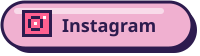

<!--
  TAWAN-OS cards
  · text and colours live in scripts/profile.mjs → edit, then run:  node scripts/build-assets.mjs
  · generated SVGs are written to assets/; each animated card also has a *-still.svg,
    swapped in through <picture> for viewers who prefer reduced motion
  · stats.svg is rebuilt daily by .github/workflows/stats.yml and published to the `output` branch
-->

<picture><source media="(prefers-reduced-motion: reduce)" srcset="assets/banner-still.svg"></picture>

<picture><source media="(prefers-reduced-motion: reduce)" srcset="assets/welcome-still.svg"></picture>

   

<picture><source media="(prefers-reduced-motion: reduce)" srcset="assets/profile-still.svg"></picture>

<picture><source media="(prefers-reduced-motion: reduce)" srcset="assets/experience-still.svg"></picture>

<a href="https://porfolio-website-five-inky.vercel.app/projects"><picture><source media="(prefers-reduced-motion: reduce)" srcset="assets/projects-still.svg"></picture></a>

<a href="https://porfolio-website-five-inky.vercel.app/projects/tawan-os-agent-harness"><picture><source media="(prefers-reduced-motion: reduce)" srcset="assets/gallery-tawan-os-agent-harness-still.svg"></picture></a> <a href="https://porfolio-website-five-inky.vercel.app/projects/hybricareer-ai"><picture><source media="(prefers-reduced-motion: reduce)" srcset="assets/gallery-hybricareer-ai-still.svg"></picture></a> <a href="https://porfolio-website-five-inky.vercel.app/projects/lorcana-cloud-playlab"><picture><source media="(prefers-reduced-motion: reduce)" srcset="assets/gallery-lorcana-cloud-playlab-still.svg"></picture></a>
<a href="https://porfolio-website-five-inky.vercel.app/projects/redbull-f1-verstappen"><picture><source media="(prefers-reduced-motion: reduce)" srcset="assets/gallery-redbull-f1-verstappen-still.svg"></picture></a> <a href="https://porfolio-website-five-inky.vercel.app/projects/vps-tycoon"><picture><source media="(prefers-reduced-motion: reduce)" srcset="assets/gallery-vps-tycoon-still.svg"></picture></a> <a href="https://porfolio-website-five-inky.vercel.app/projects/criminal-mind"><picture><source media="(prefers-reduced-motion: reduce)" srcset="assets/gallery-criminal-mind-still.svg"></picture></a>

<picture><source media="(prefers-reduced-motion: reduce)" srcset="https://raw.githubusercontent.com/tawaninm/tawaninm/output/stats-still.svg"></picture>

 

<picture><source media="(prefers-reduced-motion: reduce)" srcset="assets/footer-still.svg"></picture>

