<!--
  TAWAN-OS cards
  · text and colours live in scripts/profile.mjs → edit, then run:  node scripts/build-assets.mjs
  · generated SVGs are written to assets/
-->

   

# Hi  My name is Thanatpat Promthong

## Information Technology Student - Faculty of Information Technology, King Mongkut's Institute of Technology Ladkrabang

## UX/UI Designer | Game Developer | Web/App Developer | IT Teacher

I'm an Information Technology student based in Bangkok, Thailand.
I enjoy building digital products, games, websites, and user interfaces that combine design, technology, creativity, and real user experience.

My interests include **UX/UI Design**, **Product Design**, **Game Development**, **Web/App Development**, **AI Tools**, **Design Systems**, and **Productivity Systems**.

* 🌍 I'm based in Bangkok, Thailand
* 🎓 Faculty of Information Technology, King Mongkut's Institute of Technology Ladkrabang
* 🎨 UX/UI Designer Intern at Gumon Technology
* 👨‍🏫 Part-time IT Teacher for primary school students
* 🎮 Game Dev - Unity, Godot, Unreal Engine
* 💻 Programming - C#, GDScript, Java, HTML, CSS, JavaScript, Lua, SQL, Python
* 🤖 Exploring AI tools for coding, research, design, learning, and productivity
* ✉️ You can contact me at [tawaninm13@gmail.com](mailto:tawaninm13@gmail.com)

### Currently Focused On

* UX/UI Design and Product Design
* Design Systems and reusable UI components
* Frontend Web Development
* Game Development with Unity, Godot, and Unreal Engine
* AI-assisted workflows for learning, coding, design, research, and productivity
* Teaching coding and technology to young learners
* Building portfolio projects and real-world digital products

### Skills

#### UX / UI Tool

#### UX / UI Knowledge

#### Dev Tool

#### Game Development

#### Coding Languages

#### AI Skill

### Socials

 
<a href="https://www.facebook.com/thanatthapat.promthong" target="_blank" rel="noreferrer"> 
<picture> 
<source media="(prefers-color-scheme: dark)" srcset="https://raw.githubusercontent.com/danielcranney/readme-generator/main/public/icons/socials/facebook-dark.svg" /> 
<source media="(prefers-color-scheme: light)" srcset="https://raw.githubusercontent.com/danielcranney/readme-generator/main/public/icons/socials/facebook.svg" /> 
 
</picture> 
</a> 
<a href="https://www.github.com/tawaninm" target="_blank" rel="noreferrer"> 
<picture> 
<source media="(prefers-color-scheme: dark)" srcset="https://raw.githubusercontent.com/danielcranney/readme-generator/main/public/icons/socials/github-dark.svg" /> 
<source media="(prefers-color-scheme: light)" srcset="https://raw.githubusercontent.com/danielcranney/readme-generator/main/public/icons/socials/github.svg" /> 
 
</picture> 
</a> 
<a href="http://www.instagram.com/towo_tawan" target="_blank" rel="noreferrer"> 
<picture> 
<source media="(prefers-color-scheme: dark)" srcset="https://raw.githubusercontent.com/danielcranney/readme-generator/main/public/icons/socials/instagram-dark.svg" /> 
<source media="(prefers-color-scheme: light)" srcset="https://raw.githubusercontent.com/danielcranney/readme-generator/main/public/icons/socials/instagram.svg" /> 
 
</picture> 
</a>

### Badges

<b>My GitHub Stats</b>

